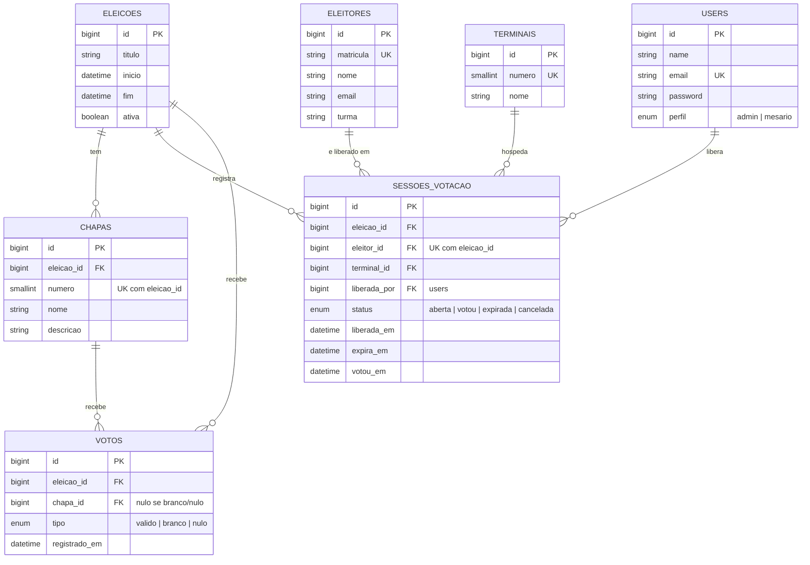

# Modelo de dados

Banco: MySQL/MariaDB, charset `utf8mb4`. Estrutura versionada em `database/migrations/`.
Nunca altere tabela pelo phpMyAdmin: crie uma migration (`php artisan make:migration`).

## Diagrama



Repare: **nenhuma linha liga `VOTOS` a `ELEITORES`, `TERMINAIS` ou `SESSOES_VOTACAO`.** Isso é o sigilo do voto (ver `DECISOES.md`, D3).

## Tabelas

| Tabela            | Papel                                                     | Regras garantidas pelo banco                                   |
| ----------------- | --------------------------------------------------------- | -------------------------------------------------------------- |
| `users`           | Admin e mesários (login)                                  | `email` único                                                  |
| `eleicoes`        | Período e título de cada eleição                          | —  (uma `ativa` por vez é regra de aplicação)                 |
| `chapas`          | Opções de voto de uma eleição                             | `numero` único dentro da eleição; some com a eleição (CASCADE) |
| `eleitores`       | Quem pode votar                                           | `matricula` única                                              |
| `terminais`       | Computadores onde a urna abre                             | `numero` único                                                 |
| `sessoes_votacao` | "Assinatura na ata": liberação do eleitor em um terminal  | **um registro por eleitor por eleição** (UNIQUE) = sem voto duplo |
| `votos`           | O voto em si, anônimo                                     | `chapa_id` nulo quando `tipo` ≠ `valido`                       |

Tabelas padrão do Laravel (`sessions`, `cache`, `jobs`, `password_reset_tokens`, ...) também existem; não mexa nelas.

## Ciclo de vida de uma sessão de votação

```
mesário libera  ──▶ aberta ──(eleitor vota)──▶ votou
                      │
                      ├──(30 min sem votar)──▶ expirada ──(mesário libera de novo: UPDATE na mesma linha)──▶ aberta
                      └──(mesário cancela)──▶ cancelada
```

Como a linha é única por eleitor e eleição, "liberar de novo" é **atualizar** a mesma linha, nunca inserir outra. Só sessões com `status = votou` bloqueiam nova liberação.

## Registro de um voto (transação)

1. Verificar que a sessão do terminal está `aberta` e não expirou.
2. `INSERT` em `votos` (`eleicao_id`, `chapa_id` ou nulo, `tipo`, `registrado_em`).
3. `UPDATE sessoes_votacao SET status='votou', votou_em=NOW()`.
4. Tudo dentro de `DB::transaction()`. Se 3 falhar, 2 é desfeito.

## O que ainda não está modelado (decidir quando a história chegar)

- **Candidatos por chapa** (nome do presidente/vice): hoje vai em `chapas.descricao`. Se precisar foto ou cargo, criar `candidatos (chapa_id, nome, cargo, foto)`.
- **Auditoria**: história H10. Sugestão: tabela `auditoria (user_id, acao, detalhes JSON, ip, created_at)` ou o pacote `spatie/laravel-activitylog`.
- **Eleitores por eleição**: hoje todo eleitor cadastrado é apto em qualquer eleição. Se um colegiado tiver eleitorado diferente, criar tabela pivô `eleicao_eleitor`.
