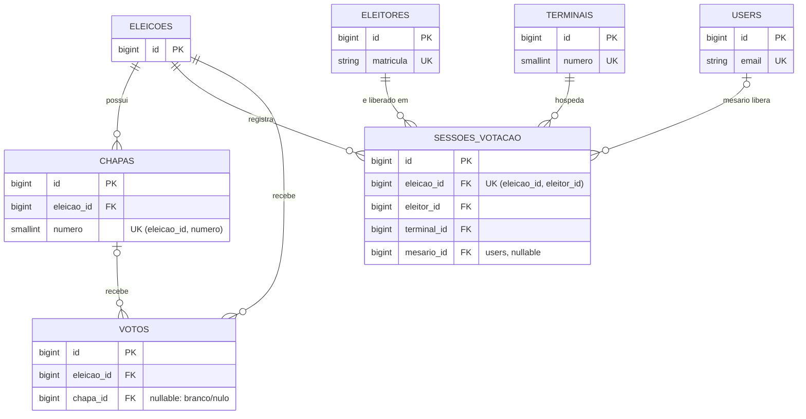

# Modelo de dados

Banco: MySQL/MariaDB, charset `utf8mb4`. Estrutura versionada em `database/migrations/`.

**As migrations do scaffold contêm apenas chaves e constraints.** Os demais atributos de cada tabela (nomes, datas, situação, e-mail, descrição...) são decisão da equipe, adicionados por novas migrations. Nunca altere tabela pelo phpMyAdmin: `php artisan make:migration add_titulo_to_eleicoes_table`.

## Diagrama entidade-relacionamento (o que existe hoje)

Repare: **nenhuma linha liga `VOTOS` a `ELEITORES`, `TERMINAIS`, `USERS` ou `SESSOES_VOTACAO`.** Isso é o sigilo do voto (`DECISOES.md`, D3). `users` tem `name`/`password` do Laravel; `created_at`/`updated_at` existem em todas as tabelas (convenção do Eloquent) e foram omitidos do diagrama.

## Constraints e o que cada uma garante

| Constraint                                        | Regra de negócio garantida pelo banco                                   | Teste            |
| ------------------------------------------------- | ----------------------------------------------------------------------- | ---------------- |
| `sessoes_votacao UNIQUE (eleicao_id, eleitor_id)` | Um eleitor tem **uma** sessão por eleição: sem voto duplo               | `SigiloDoVotoTest` |
| `chapas UNIQUE (eleicao_id, numero)`              | Número de chapa único dentro da eleição; pode repetir em outra eleição  | `SigiloDoVotoTest` |
| `eleitores.matricula UNIQUE`                      | Um cadastro por matrícula                                               | —                |
| `terminais.numero UNIQUE`                         | Um terminal por número (a URL da urna usa o número)                     | —                |
| `votos` sem FK para eleitor/terminal/sessão       | Sigilo do voto                                                          | `SigiloDoVotoTest` |
| `votos.chapa_id` nullable                         | Voto em branco/nulo possível sem chapa                                  | `SigiloDoVotoTest` |
| `ON DELETE CASCADE` a partir de `eleicoes`        | Apagar eleição apaga chapas, sessões e votos dela                       | `SigiloDoVotoTest` |
| `sessoes_votacao.terminal_id ON DELETE RESTRICT`  | Terminal com histórico de sessão não pode ser apagado                   | `SigiloDoVotoTest` |
| `sessoes_votacao.mesario_id ON DELETE SET NULL`   | Remover um usuário mesário não apaga a ata                              | —                |
| `votos.chapa_id ON DELETE SET NULL`               | Remover chapa não apaga votos (vira "sem chapa"); decidir se deve ser RESTRICT | —          |

## Atributos: perguntas para a equipe responder (uma migration por resposta)

| Tabela            | O que falta decidir                                                                                   | História |
| ----------------- | ----------------------------------------------------------------------------------------------------- | -------- |
| `users`           | Como distinguir admin de mesário? (coluna `perfil`? tabela `perfis`? pacote de permissões?)           | H1       |
| `eleicoes`        | Título, período (início/fim), como marcar a eleição ativa                                             | H2       |
| `chapas`          | Nome, descrição, candidatos (coluna ou tabela `candidatos`?), foto                                    | H3       |
| `eleitores`       | Nome, e-mail, turma; eleitor é apto em toda eleição ou precisa de tabela `eleicao_eleitor`?           | H4       |
| `terminais`       | Nome/local                                                                                            | H5       |
| `sessoes_votacao` | Situação (aberta/votou/expirada/cancelada), horários de liberação, expiração e voto                   | H6, H8   |
| `votos`           | Como diferenciar branco de nulo (coluna `tipo`?), quando foi registrado (cuidado: horário exato + poucos votantes permite correlacionar com a sessão) | H8, H10 |
| (nova) auditoria  | Quem fez o quê e quando; nunca em quem votou                                                          | H11      |

## Registro de um voto (transação)

1. Verificar que a sessão do terminal está liberada e válida (critério definido pela equipe).
2. `INSERT` em `votos` (`eleicao_id`, `chapa_id` ou nulo).
3. Marcar a sessão como votada.
4. Tudo dentro de `DB::transaction()`. Se 3 falhar, 2 é desfeito.
